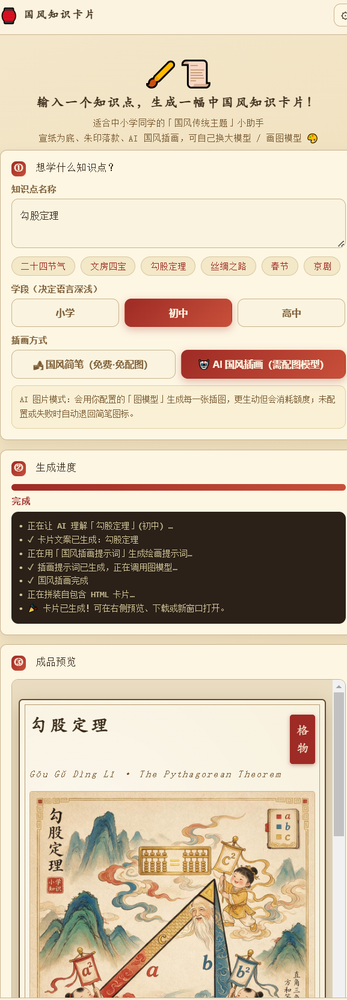

# 国风知识卡片 · 智能体



将任意知识点转化为**中国风传统主题插画风格**的知识卡片。宣纸为底、朱印落款、楷体标题，AI 生成国风插画与文案，一键导出自包含 HTML。

## 快速开始

1. 确保已安装 [Node.js](https://nodejs.org)（LTS 版，勾选 Add to PATH）
2. 下载本仓库，双击 `启动.bat`，浏览器自动打开 `http://127.0.0.1:8788`
3. 点击右上角 ⚙ 设置，填入你的 LLM API Key（可选配置图模型），输入知识点即可生成卡片

> 未配置 Key 也能用：内置国风简笔占位插画 + SVG 图标库可生成完整卡片。

## 在线演示

- [勾股定理](demo/勾股定理.html)
- [二十四节气](demo/二十四节气.html)

## 配置说明

复制 `.env.example` 为 `.env`，填入你的 API Key：

```env
LLM_BASE_URL=https://api.deepseek.com/v1
LLM_API_KEY=sk-你的Key
LLM_MODEL=deepseek-chat

# 图像模型可选，留空使用内置简笔插画
IMG_BASE_URL=
IMG_API_KEY=
IMG_MODEL=
IMG_SIZE=1024x1024
```

支持 DeepSeek、通义千问、智谱、Kimi、OpenAI 等 OpenAI 兼容接口的 LLM，以及通义万相、硅基流动、火山方舟等图模型。

## 文件结构

```
├── 启动.bat              # 主启动器（自动探测 Node）
├── 启动.vbs              # 备用启动器
├── 修复bat关联.reg        # 修复 .bat 文件关联
├── server.js             # 零依赖 Node 后端
├── index.html            # 前端页面
├── css/styles.css        # 国风主题样式
├── js/app.js             # 前端逻辑
├── .env.example          # 配置模板（不含真实 Key）
├── .gitignore            # 忽略 .env / output / 日志
├── 使用说明.md            # 详细使用说明
├── SKILL.md              # 技能元信息
├── demo/                 # 生成的示例卡片
└── assets/               # README 配图
```

## 功能特点

- **国风卡片排版**：宣纸底色、朱红印章、楷体标题、墨色正文、留白构图
- **AI 文案**：LLM 生成知识点释义、要点、口诀金句，适配小学/初中/高中
- **AI 国风插画**：Coze 原版 systemPrompt 驱动，支持工笔/水墨/年画/青绿山水等风格
- **多服务商预设**：9 家 LLM + 4 家图模型一键填充
- **自包含导出**：生成的 HTML 单文件，离线可看、可打印

## 来源

由扣子(Coze)工作流「知识卡片_中国风传统主题插画风格」转换而来。原工作流的「图片提示词」节点 systemPrompt 已原样移植为 `COZE_IMAGE_SYSTEM` 常量，保证国风插画提示词的专业性。
